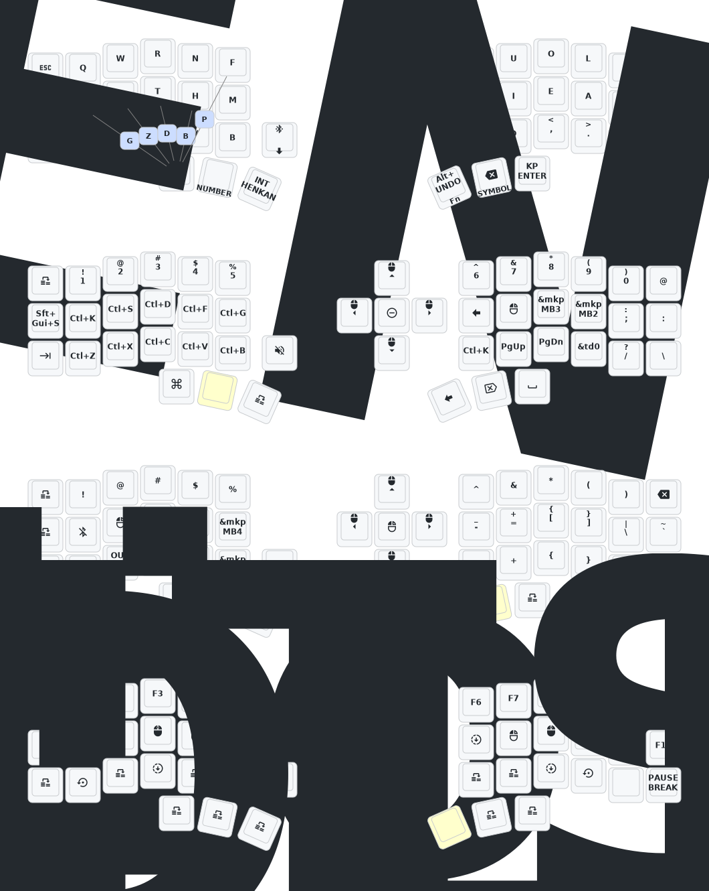

- [Japanese](README_JP.md)
- [English](README.md)

# Corne ZMK Repository

**This keyboard is not the same as [foostan's Corne](https://github.com/foostan/crkbd). It will not work with standard `corne` firmware.**

## Instructions

1. [Fork this repository](https://docs.github.com/en/get-started/quickstart/fork-a-repo#forking-a-repository).
2. [Click the **Actions** tab and make sure the workflow is enabled](https://docs.github.com/en/actions/managing-workflow-runs-and-deployments/managing-workflow-runs/disabling-and-enabling-a-workflow#enabling-a-workflow).
3. Use [Keymap Editor](https://nickcoutsos.github.io/keymap-editor/) to remap easier. 

**If you already have a ZMK config repository, [you can add this one as a module instead of forking](https://zmk.dev/docs/features/modules#building-with-modules).**

## Keymap Diagram

## How to Edit Keymap

1. After you **commit the change from Keymap Editor**, the **GitHub Action** will be automatically triggered, and the firmware will start to build. Once the action is finished, you can **download the firmware** to your computer.

2. **Connect the left keyboard** and **press the reset button twice**. The keyboard should now appear as a mass storage device.

3. Move `eyelash_corne_studio_left.uf2`, `nice_view-eyelash_corne_left-zmk.uf2` to the storage at the same time. Once the transfer is complete, the storage will **automatically eject**.

4. **Connect the right keyboard** and **press the reset button twice**. The keyboard should now appear as a mass storage device.

5. Move `nice_view-eyelash_corne_right-zmk.uf2` to the storage. Once the transfer is complete, the storage will **automatically eject**.

## How to reset the keyboard

1. **Connect the left keyboard** and **press the reset button twice**. The keyboard should now appear as a mass storage device.

2. Move `settings_reset-eyelash_corne_left-zmk.uf2` to the storage at the same time. Once the transfer is complete, the storage will **automatically eject**.

3. **Connect the right keyboard** and **press the reset button twice**. The keyboard should now appear as a mass storage device.

4. Move `settings_reset-eyelash_corne_left-zmk.uf2` to the storage. Once the transfer is complete, the storage will **automatically eject**.
